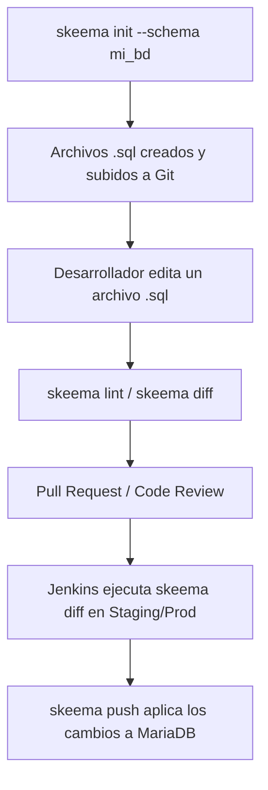

# Primeros Pasos con Skeema

Esta guía forma parte de la base de conocimiento para la gestión de esquemas de bases de datos **MariaDB** utilizando **Skeema**, orientada a su posterior integración y automatización con **Jenkins** en el ciclo de CI/CD.

---

## 1. ¿Qué es Skeema?

**Skeema** es una herramienta de CLI (línea de comandos) de código abierto diseñada para gestionar esquemas de bases de datos MySQL y MariaDB de forma declarativa.

### Características Principales
- **Gestión Declarativa ("Schema-as-Code"):** Define el estado deseado de tus tablas en archivos `.sql` limpios y versionables en Git (mediante sentencias estándar `CREATE TABLE`).
- **Idempotente y Seguro:** Skeema calcula las diferencias entre los archivos y la base de datos real, generando automáticamente las sentencias `ALTER`, `CREATE` o `DROP` necesarias.
- **Prevención de Errores:** Incluye linters de esquema integrados y advertencias de seguridad para operaciones destructivas (por ejemplo, evitar borrado accidental de tablas o columnas sin confirmación previa).
- **Ideal para CI/CD:** Encaja de manera natural en pipelines (como Jenkins) para validar cambios en ramas (PRs) y aplicar migraciones de forma desatendida.

---

## 2. Requisitos Previos

- Contar con el binario de **Skeema** instalado en el sistema o agente de Jenkins.
- Instancia en ejecución de **MariaDB**.
- Un usuario con privilegios suficientes (e.g. `SELECT`, `SHOW VIEW`, `ALTER`, `CREATE`, `DROP` sobre la base de datos a gestionar).

---

## 3. Comandos Básicos

### 3.1. `skeema init`: Inicializar el repositorio de esquemas

El comando `skeema init` inspecciona un servidor MariaDB y vuelca las definiciones de las tablas en archivos `.sql` organizados en carpetas, creando además un archivo de configuración `.skeema`.

> [!IMPORTANT]
> **Uso del parámetro `--schema`:**
> Por defecto, si no se especifica un esquema, `skeema init` intentará recorrer y exportar **todos los esquemas/bases de datos** presentes en la instancia del servidor.
> 
> Para restringir la inicialización a **una única base de datos**, es indispensable utilizar la opción `--schema <nombre_bd>`.

#### Ejemplo de inicialización:
```bash
skeema init \
  --host 127.0.0.1 \
  --port 3306 \
  --user root \
  --password \
  --schema mi_base_de_datos \
  -d ./mi_base_de_datos
```

**Parámetros clave:**
- `-h, --host`: Dirección del servidor MariaDB.
- `-P, --port`: Puerto (por defecto 3306).
- `-u, --user`: Usuario de conexión.
- `-p, --password`: Solicita la contraseña por terminal (o se puede pasar directamente si se automatiza).
- `--schema`: **Especifica la única base de datos a exportar**, evitando volcar bases de datos del sistema u otros esquemas no deseados.
- `-d, --dir`: Directorio destino donde se generará la estructura de archivos (por defecto el directorio actual).

Al ejecutarse, creará:
- Un archivo `.skeema` con la configuración de conexión y variables del esquema.
- Un archivo `.sql` por cada tabla, vista o procedimiento dentro de la base de datos indicada.

---

### 3.2. `skeema diff`: Comparar cambios

Compara el estado definido en los archivos `.sql` locales contra la base de datos remota/local configurada en el `.skeema`. Muestra en pantalla el SQL (`ALTER TABLE`, `CREATE TABLE`, etc.) necesario para sincronizar la base de datos con el repositorio.

```bash
cd mi_base_de_datos
skeema diff
```

**Comportamiento:**
- No realiza ninguna modificación en la base de datos (operación de solo lectura).
- Si hay diferencias, retorna código de salida `1` (muy útil para pasos de validación en Jenkins).
- Si no hay diferencias, retorna código de salida `0`.

---

### 3.3. `skeema push`: Aplicar actualizaciones en la base de datos

Ejecuta las modificaciones DDL calculadas para que la base de datos coincida exactamente con las definiciones de los archivos `.sql`.

```bash
cd mi_base_de_datos
skeema push
```

**Operaciones destructivas:**
Si un cambio implica borrar una tabla o una columna, Skeema abortará la operación por seguridad a menos que se use explícitamente la bandera correspondiente:
- `--allow-unsafe`: Permite operaciones potencialmente destructivas de datos (ej. eliminar o modificar columnas existentes).

---

### 3.4. `skeema pull`: Actualizar los archivos locales desde la base de datos

Si se realizaron modificaciones manuales directamente en la base de datos y se desea actualizar los archivos `.sql` locales para reflejar dichos cambios:

```bash
cd mi_base_de_datos
skeema pull
```

---

### 3.5. `skeema lint`: Validación estática de sintaxis

Analiza los archivos `.sql` locales en busca de errores de sintaxis, violaciones de buenas prácticas o reglas configuradas (ej. obligar a que toda tabla tenga clave primaria).

```bash
skeema lint
```

---

## 4. Flujo Típico de Trabajo



1. **Inicialización (una sola vez):** Se exporta la base de datos con `skeema init --schema <nombre_bd>`.
2. **Desarrollo:** Cualquier cambio a una tabla se hace editando directamente su archivo `.sql` correspondiente.
3. **Validación:** Se verifica con `skeema lint` y `skeema diff`.
4. **Despliegue:** Jenkins valida con `skeema diff` y aplica a MariaDB con `skeema push`.
